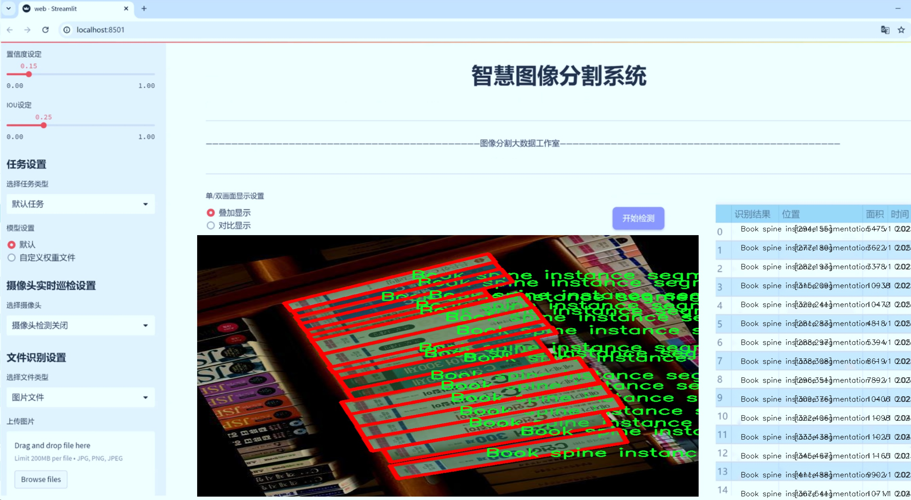
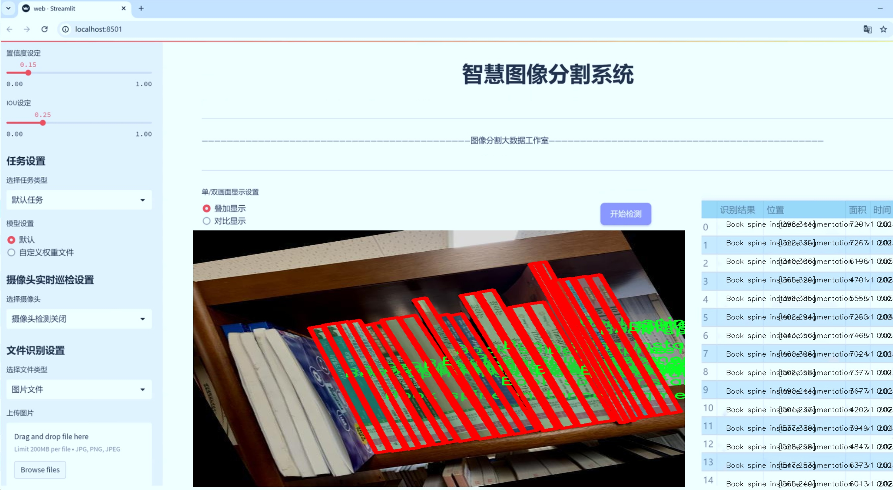
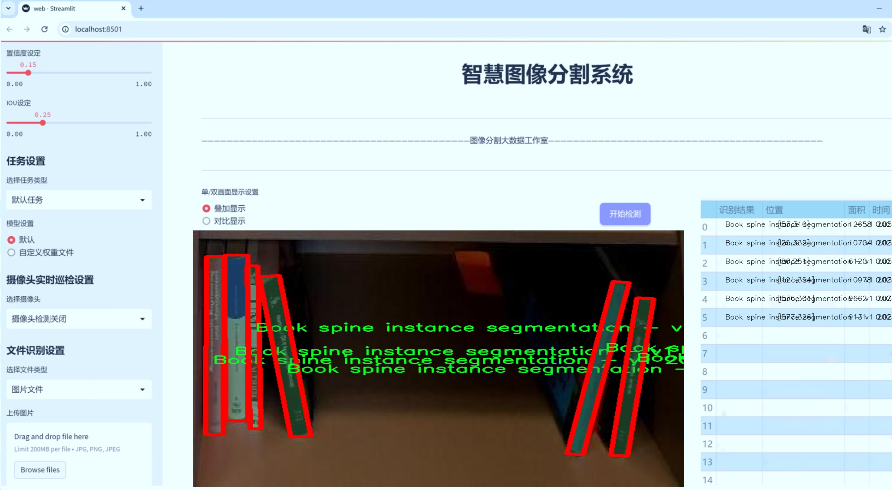
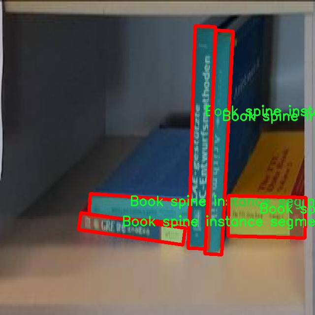
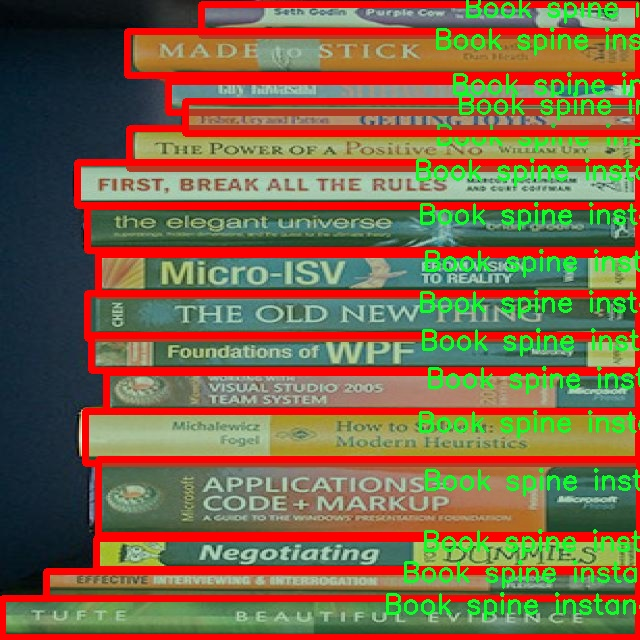
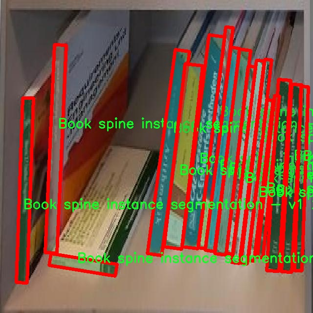
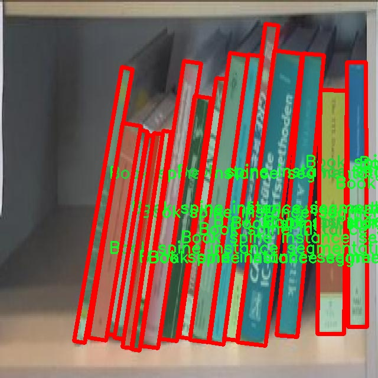
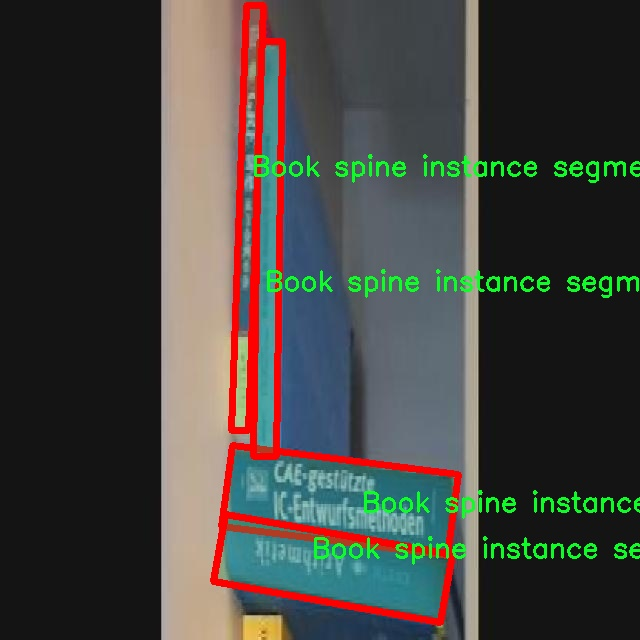

# 书脊图像分割系统源码＆数据集分享
 [yolov8-seg-C2f-DAttention＆yolov8-seg-EfficientHead等50+全套改进创新点发刊_一键训练教程_Web前端展示]

### 1.研究背景与意义

项目参考[ILSVRC ImageNet Large Scale Visual Recognition Challenge](https://gitee.com/YOLOv8_YOLOv11_Segmentation_Studio/projects)

项目来源[AAAI Global Al lnnovation Contest](https://kdocs.cn/l/cszuIiCKVNis)

研究背景与意义

随着信息技术的迅猛发展，数字化图书馆和在线阅读平台的兴起，图书的管理与检索方式也发生了深刻的变革。在这一背景下，书籍的数字化处理显得尤为重要，而书脊图像的自动识别与分割则是实现书籍信息提取和管理的关键环节。传统的书籍管理方式往往依赖人工标注和分类，不仅效率低下，而且容易受到人为因素的影响，导致错误和遗漏。因此，开发一种高效、准确的书脊图像分割系统，能够显著提升图书管理的自动化水平和信息检索的精准度。

在众多计算机视觉技术中，基于深度学习的实例分割方法近年来得到了广泛的关注与应用。YOLO（You Only Look Once）系列模型因其高效的实时检测能力而受到青睐。YOLOv8作为该系列的最新版本，结合了更为先进的特征提取网络和改进的损失函数，能够在保持高精度的同时实现快速推理。针对书脊图像的特点，改进YOLOv8模型能够更好地适应复杂的背景和多样的书脊形态，从而实现更为精准的分割效果。

本研究所使用的数据集包含1400张书脊图像，分为两类，主要用于训练和验证改进YOLOv8模型的实例分割能力。数据集的丰富性和多样性为模型的训练提供了良好的基础，使其能够学习到不同书脊的特征与结构。通过对书脊图像的有效分割，系统不仅能够提取出书脊的轮廓信息，还能够为后续的书籍信息识别和分类提供支持。这一过程不仅提高了图书管理的自动化程度，还为图书馆、书店等机构的数字化转型提供了技术保障。

此外，书脊图像分割系统的研究还具有重要的社会意义。在信息化时代，知识的获取和传播愈发依赖于数字化内容的组织与管理。通过高效的书脊图像分割，用户能够更快速地找到所需书籍，提升阅读体验。同时，该技术的推广应用也将推动图书馆、出版社等行业的数字化转型，促进文化资源的共享与传播。

综上所述，基于改进YOLOv8的书脊图像分割系统的研究，不仅具有重要的学术价值，也为实际应用提供了切实可行的解决方案。通过深入探讨该系统的设计与实现，期望能够为图书管理领域的智能化发展贡献一份力量，为信息技术与文化产业的融合提供新的思路与方法。

### 2.图片演示







##### 注意：由于此博客编辑较早，上面“2.图片演示”和“3.视频演示”展示的系统图片或者视频可能为老版本，新版本在老版本的基础上升级如下：（实际效果以升级的新版本为准）

  （1）适配了YOLOV8的“目标检测”模型和“实例分割”模型，通过加载相应的权重（.pt）文件即可自适应加载模型。

  （2）支持“图片识别”、“视频识别”、“摄像头实时识别”三种识别模式。

  （3）支持“图片识别”、“视频识别”、“摄像头实时识别”三种识别结果保存导出，解决手动导出（容易卡顿出现爆内存）存在的问题，识别完自动保存结果并导出到tempDir中。

  （4）支持Web前端系统中的标题、背景图等自定义修改，后面提供修改教程。

  另外本项目提供训练的数据集和训练教程,暂不提供权重文件（best.pt）,需要您按照教程进行训练后实现图片演示和Web前端界面演示的效果。

### 3.视频演示

[3.1 视频演示](https://www.bilibili.com/video/BV1G9DZYSEgt/)

### 4.数据集信息展示

##### 4.1 本项目数据集详细数据（类别数＆类别名）

nc: 2
names: ['Book spine instance segmentation - v1 2023-02-13 7-07am', 'object']


##### 4.2 本项目数据集信息介绍

数据集信息展示

在本研究中，我们使用了名为“Book spline detection”的数据集，以支持改进YOLOv8-seg的书脊图像分割系统的训练与评估。该数据集专注于书脊的实例分割任务，旨在提高计算机视觉模型在图书馆、书店及数字图书管理系统中的应用效果。数据集包含两个主要类别，分别为“Book spine instance segmentation - v1 2023-02-13 7-07am”和“object”。这两个类别的设置不仅涵盖了书脊的实例，还包括了其他可能干扰分割任务的对象，从而为模型提供了更为丰富的训练背景。

“Book spline detection”数据集的构建经过精心设计，确保其在多样性和复杂性方面能够满足深度学习模型的需求。数据集中的图像来源于不同类型的书籍，涵盖了各种尺寸、颜色和材质的书脊。这种多样性使得模型在训练过程中能够学习到不同书脊的特征，进而提高其在实际应用中的鲁棒性。此外，数据集中包含的图像均经过精确标注，确保每个书脊实例都能被清晰识别。这一标注过程不仅提升了数据集的质量，也为后续的模型训练提供了坚实的基础。

在数据集的使用过程中，我们特别关注了图像的分辨率和质量。高分辨率的图像能够提供更多的细节信息，使得模型在进行实例分割时能够更准确地识别书脊的边缘和形状。同时，数据集中的图像也经过了适当的预处理，以消除噪声和干扰因素，从而进一步提高模型的训练效果。通过这些措施，我们期望在YOLOv8-seg模型的训练中实现更高的准确率和更好的分割效果。

为了验证模型的性能，我们将数据集划分为训练集和验证集，确保模型在训练过程中能够有效地学习到书脊的特征，同时在验证集上进行评估，以检测模型的泛化能力。我们还计划在训练过程中采用数据增强技术，以增加数据集的多样性，帮助模型更好地适应不同的环境和条件。这些技术的应用将有助于提高模型在实际应用中的表现，确保其能够在各种场景下稳定运行。

总之，“Book spline detection”数据集为改进YOLOv8-seg的书脊图像分割系统提供了坚实的基础。通过对数据集的深入分析和有效利用，我们希望能够显著提升模型的性能，使其在图书管理、数字化存档等领域发挥更大的作用。未来，我们还计划持续优化数据集，增加更多的书脊实例和类别，以进一步提升模型的能力和适用范围。











### 5.全套项目环境部署视频教程（零基础手把手教学）

[5.1 环境部署教程链接（零基础手把手教学）](https://www.bilibili.com/video/BV1jG4Ve4E9t/?vd_source=bc9aec86d164b67a7004b996143742dc)


[5.2 安装Python虚拟环境创建和依赖库安装视频教程链接（零基础手把手教学）](https://www.bilibili.com/video/BV1nA4VeYEze/?vd_source=bc9aec86d164b67a7004b996143742dc)

### 6.手把手YOLOV8-seg训练视频教程（零基础小白有手就能学会）

[6.1 手把手YOLOV8-seg训练视频教程（零基础小白有手就能学会）](https://www.bilibili.com/video/BV1cA4VeYETe/?vd_source=bc9aec86d164b67a7004b996143742dc)


按照上面的训练视频教程链接加载项目提供的数据集，运行train.py即可开始训练



     Epoch   gpu_mem       box       obj       cls    labels  img_size
     1/200     0G   0.01576   0.01955  0.007536        22      1280: 100%|██████████| 849/849 [14:42<00:00,  1.04s/it]
               Class     Images     Labels          P          R     mAP@.5 mAP@.5:.95: 100%|██████████| 213/213 [01:14<00:00,  2.87it/s]
                 all       3395      17314      0.994      0.957      0.0957      0.0843

     Epoch   gpu_mem       box       obj       cls    labels  img_size
     2/200     0G   0.01578   0.01923  0.007006        22      1280: 100%|██████████| 849/849 [14:44<00:00,  1.04s/it]
               Class     Images     Labels          P          R     mAP@.5 mAP@.5:.95: 100%|██████████| 213/213 [01:12<00:00,  2.95it/s]
                 all       3395      17314      0.996      0.956      0.0957      0.0845

     Epoch   gpu_mem       box       obj       cls    labels  img_size
     3/200     0G   0.01561    0.0191  0.006895        27      1280: 100%|██████████| 849/849 [10:56<00:00,  1.29it/s]
               Class     Images     Labels          P          R     mAP@.5 mAP@.5:.95: 100%|███████   | 187/213 [00:52<00:00,  4.04it/s]
                 all       3395      17314      0.996      0.957      0.0957      0.0845


### 7.50+种全套YOLOV8-seg创新点代码加载调参视频教程（一键加载写好的改进模型的配置文件）

[7.1 50+种全套YOLOV8-seg创新点代码加载调参视频教程（一键加载写好的改进模型的配置文件）](https://www.bilibili.com/video/BV1Hw4VePEXv/?vd_source=bc9aec86d164b67a7004b996143742dc)

### 8.YOLOV8-seg图像分割算法原理

原始YOLOv8-seg算法原理

YOLOv8-seg算法是YOLO系列模型的最新进展，结合了目标检测与图像分割的任务，旨在实现更高效的物体识别与精确分割。作为YOLOv8的一个扩展版本，YOLOv8-seg在保留原有YOLOv8的核心架构的基础上，进一步增强了特征提取与处理能力，使其在复杂场景下的表现更加优异。

首先，YOLOv8-seg的网络结构依然遵循YOLO系列一贯的设计理念，主要由Backbone、Neck和Head三部分组成。Backbone部分采用了CSPDarknet结构，经过改进的C2f模块在特征提取过程中发挥了重要作用。C2f模块的设计灵感来源于YOLOv5的C3模块与YOLOv7的ELAN思想，通过引入更多的跳层连接，C2f模块能够有效缓解深层网络中的梯度消失问题，确保信息在网络中的流动更加顺畅。具体而言，C2f模块将输入特征图分为两个分支，分别经过卷积层进行处理，并最终将两个分支的特征进行融合。这种结构不仅提升了特征图的维度，还丰富了模型的梯度流信息，使得YOLOv8-seg在处理复杂图像时能够提取到更为细致的特征。

在特征提取的过程中，YOLOv8-seg还引入了快速空间金字塔池化（SPPF）结构，旨在有效提取不同尺度的特征。这一结构的优势在于能够在减少模型参数和计算量的同时，提升特征提取的效率。通过对多尺度特征的有效融合，YOLOv8-seg能够更好地适应各种目标的大小和形状，进而提高检测与分割的准确性。

Neck部分采用了PAN-FPN结构，进一步增强了特征融合的能力。该结构通过自下而上的特征融合与自上而下的特征传递，有效地整合了来自不同层次的特征信息。具体来说，Neck部分首先将高层特征与中层特征进行融合，然后再与浅层特征进行结合。这种深度融合的方式确保了YOLOv8-seg在进行目标检测时，能够同时利用高层特征的语义信息与浅层特征的细节信息，从而实现更为精准的目标定位与分割。

在Head部分，YOLOv8-seg引入了解耦头的设计思路，将分类与回归任务分开处理。这一策略使得模型在进行目标分类时，能够更加专注于特征图中的相似性分析，而在进行边界框回归时，则更关注于目标的定位精度。通过这种方式，YOLOv8-seg在检测小目标时表现尤为突出，能够有效地处理复杂背景下的目标分割任务。

YOLOv8-seg还采用了无锚框（Anchor-Free）的检测方式，直接预测目标的中心点及其宽高比例。这一创新使得模型在处理目标时，能够避免传统锚框方法带来的局限性，从而提高了检测速度与准确度。此外，YOLOv8-seg在损失函数的设计上也进行了优化，采用了VFLLoss与DFLLoss+CIoULoss的组合，进一步提升了模型的学习能力与泛化性能。

为了应对样本不平衡的问题，YOLOv8-seg引入了Focal Loss作为分类损失函数。这一损失函数通过调节正负样本的权重，使得模型在训练过程中能够更加关注难以分类的样本，从而提升了模型的整体性能。结合Task-Aligned的样本匹配策略，YOLOv8-seg能够更好地处理不同类别样本的分布，提高了训练的效率与效果。

在数据预处理方面，YOLOv8-seg采用了多种增强手段，包括马赛克增强、混合增强、空间扰动与颜色扰动等。这些增强手段的引入，不仅提升了模型的鲁棒性与泛化能力，还有效防止了模型在训练过程中对不良信息的学习。值得注意的是，YOLOv8-seg在训练的最后阶段停止使用马赛克增强，以避免对数据真实分布的破坏，从而确保模型的学习质量。

综上所述，YOLOv8-seg算法通过对YOLOv8的多项改进与创新，成功实现了目标检测与图像分割的高效结合。其在特征提取、特征融合、损失函数设计及数据增强等方面的优化，使得YOLOv8-seg在复杂场景下的表现更加优异，具备了更高的准确性与实时性。随着YOLOv8-seg的不断发展与应用，其在实际场景中的潜力与价值将进一步得到体现，成为目标检测与分割领域的重要工具。


### 9.系统功能展示（检测对象为举例，实际内容以本项目数据集为准）

图9.1.系统支持检测结果表格显示

  图9.2.系统支持置信度和IOU阈值手动调节

  图9.3.系统支持自定义加载权重文件best.pt(需要你通过步骤5中训练获得)

  图9.4.系统支持摄像头实时识别

  图9.5.系统支持图片识别

  图9.6.系统支持视频识别

  图9.7.系统支持识别结果文件自动保存

  图9.8.系统支持Excel导出检测结果数据


### 10.50+种全套YOLOV8-seg创新点原理讲解（非科班也可以轻松写刊发刊，V11版本正在科研待更新）

#### 10.1 由于篇幅限制，每个创新点的具体原理讲解就不一一展开，具体见下列网址中的创新点对应子项目的技术原理博客网址【Blog】：


[10.1 50+种全套YOLOV8-seg创新点原理讲解链接](https://gitee.com/qunmasj/good)

#### 10.2 部分改进模块原理讲解(完整的改进原理见上图和技术博客链接)【如果此小节的图加载失败可以通过CSDN或者Github搜索该博客的标题访问原始博客，原始博客图片显示正常】

### YOLOv8简介
#### Backbone
Darknet-53
53指的是“52层卷积”+output layer。

借鉴了其他算法的这些设计思想

借鉴了VGG的思想，使用了较多的3×3卷积，在每一次池化操作后，将通道数翻倍；

借鉴了network in network的思想，使用全局平均池化（global average pooling）做预测，并把1×1的卷积核置于3×3的卷积核之间，用来压缩特征；（我没找到这一步体现在哪里）


使用了批归一化层稳定模型训练，加速收敛，并且起到正则化作用。

    以上三点为Darknet19借鉴其他模型的点。Darknet53当然是在继承了Darknet19的这些优点的基础上再新增了下面这些优点的。因此列在了这里

借鉴了ResNet的思想，在网络中大量使用了残差连接，因此网络结构可以设计的很深，并且缓解了训练中梯度消失的问题，使得模型更容易收敛。

使用步长为2的卷积层代替池化层实现降采样。（这一点在经典的Darknet-53上是很明显的，output的长和宽从256降到128，再降低到64，一路降低到8，应该是通过步长为2的卷积层实现的；在YOLOv8的卷积层中也有体现，比如图中我标出的这些位置）

#### 特征融合

模型架构图如下

  Darknet-53的特点可以这样概括：（Conv卷积模块+Residual Block残差块）串行叠加4次

  Conv卷积层+Residual Block残差网络就被称为一个stage


上面红色指出的那个，原始的Darknet-53里面有一层 卷积，在YOLOv8里面，把一层卷积移除了

为什么移除呢？

        原始Darknet-53模型中间加的这个卷积层做了什么？滤波器（卷积核）的个数从 上一个卷积层的512个，先增加到1024个卷积核，然后下一层卷积的卷积核的个数又降低到512个

        移除掉这一层以后，少了1024个卷积核，就可以少做1024次卷积运算，同时也少了1024个3×3的卷积核的参数，也就是少了9×1024个参数需要拟合。这样可以大大减少了模型的参数，（相当于做了轻量化吧）

        移除掉这个卷积层，可能是因为作者发现移除掉这个卷积层以后，模型的score有所提升，所以才移除掉的。为什么移除掉以后，分数有所提高呢？可能是因为多了这些参数就容易，参数过多导致模型在训练集删过拟合，但是在测试集上表现很差，最终模型的分数比较低。你移除掉这个卷积层以后，参数减少了，过拟合现象不那么严重了，泛化能力增强了。当然这个是，拿着你做实验的结论，反过来再找补，再去强行解释这种现象的合理性。


通过MMdetection官方绘制册这个图我们可以看到，进来的这张图片经过一个“Feature Pyramid Network(简称FPN)”，然后最后的P3、P4、P5传递给下一层的Neck和Head去做识别任务。 PAN（Path Aggregation Network）


“FPN是自顶向下，将高层的强语义特征传递下来。PAN就是在FPN的后面添加一个自底向上的金字塔，对FPN补充，将低层的强定位特征传递上去，

FPN是自顶（小尺寸，卷积次数多得到的结果，语义信息丰富）向下（大尺寸，卷积次数少得到的结果），将高层的强语义特征传递下来，对整个金字塔进行增强，不过只增强了语义信息，对定位信息没有传递。PAN就是针对这一点，在FPN的后面添加一个自底（卷积次数少，大尺寸）向上（卷积次数多，小尺寸，语义信息丰富）的金字塔，对FPN补充，将低层的强定位特征传递上去，又被称之为“双塔战术”。

FPN层自顶向下传达强语义特征，而特征金字塔则自底向上传达强定位特征，两两联手，从不同的主干层对不同的检测层进行参数聚合,这样的操作确实很皮。
#### 自底向上增强


而 PAN（Path Aggregation Network）是对 FPN 的一种改进，它的设计理念是在 FPN 后面添加一个自底向上的金字塔。PAN 引入了路径聚合的方式，通过将浅层特征图（低分辨率但语义信息较弱）和深层特征图（高分辨率但语义信息丰富）进行聚合，并沿着特定的路径传递特征信息，将低层的强定位特征传递上去。这样的操作能够进一步增强多尺度特征的表达能力，使得 PAN 在目标检测任务中表现更加优秀。


### Gold-YOLO简介
YOLO系列模型面世至今已有8年，由于其优异的性能，已成为目标检测领域的标杆。在系列模型经过十多个不同版本的改进发展逐渐稳定完善的今天，研究人员更多关注于单个计算模块内结构的精细调整，或是head部分和训练方法上的改进。但这并不意味着现有模式已是最优解。

当前YOLO系列模型通常采用类FPN方法进行信息融合，而这一结构在融合跨层信息时存在信息损失的问题。针对这一问题，我们提出了全新的信息聚集-分发（Gather-and-Distribute Mechanism）GD机制，通过在全局视野上对不同层级的特征进行统一的聚集融合并分发注入到不同层级中，构建更加充分高效的信息交互融合机制，并基于GD机制构建了Gold-YOLO。在COCO数据集中，我们的Gold-YOLO超越了现有的YOLO系列，实现了精度-速度曲线上的SOTA。


精度和速度曲线（TensorRT7）


精度和速度曲线（TensorRT8）
传统YOLO的问题
在检测模型中，通常先经过backbone提取得到一系列不同层级的特征，FPN利用了backbone的这一特点，构建了相应的融合结构：不层级的特征包含着不同大小物体的位置信息，虽然这些特征包含的信息不同，但这些特征在相互融合后能够互相弥补彼此缺失的信息，增强每一层级信息的丰富程度，提升网络性能。

原始的FPN结构由于其层层递进的信息融合模式，使得相邻层的信息能够充分融合，但也导致了跨层信息融合存在问题：当跨层的信息进行交互融合时，由于没有直连的交互通路，只能依靠中间层充当“中介”进行融合，导致了一定的信息损失。之前的许多工作中都关注到了这一问题，而解决方案通常是通过添加shortcut增加更多的路径，以增强信息流动。

然而传统的FPN结构即便改进后，由于网络中路径过多，且交互方式不直接，基于FPN思想的信息融合结构仍然存在跨层信息交互困难和信息损失的问题。

#### Gold-YOLO：全新的信息融合交互机制


#### Gold-YOLO架构
参考该博客提出的一种全新的信息交互融合机制：信息聚集-分发机制(Gather-and-Distribute Mechanism)。该机制通过在全局上融合不同层次的特征得到全局信息，并将全局信息注入到不同层级的特征中，实现了高效的信息交互和融合。在不显著增加延迟的情况下GD机制显著增强了Neck部分的信息融合能力，提高了模型对不同大小物体的检测能力。

GD机制通过三个模块实现：信息对齐模块(FAM)、信息融合模块(IFM)和信息注入模块(Inject)。

信息对齐模块负责收集并对齐不同层级不同大小的特征

信息融合模块通过使用卷积或Transformer算子对对齐后的的特征进行融合，得到全局信息

信息注入模块将全局信息注入到不同层级中

在Gold-YOLO中，针对模型需要检测不同大小的物体的需要，并权衡精度和速度，我们构建了两个GD分支对信息进行融合：低层级信息聚集-分发分支(Low-GD)和高层级信息聚集-分发分支(High-GD)，分别基于卷积和transformer提取和融合特征信息。

此外,为了促进局部信息的流动，我们借鉴现有工作，构建了一个轻量级的邻接层融合模块，该模块在局部尺度上结合了邻近层的特征，进一步提升了模型性能。我们还引入并验证了预训练方法对YOLO模型的有效性，通过在ImageNet 1K上使用MAE方法对主干进行预训练，显著提高了模型的收敛速度和精度。


### 11.项目核心源码讲解（再也不用担心看不懂代码逻辑）

#### 11.1 ultralytics\nn\extra_modules\afpn.py

以下是经过简化和注释的核心代码部分，保留了主要的类和方法，并对每个部分进行了详细的中文注释。

```python
import torch
import torch.nn as nn
import torch.nn.functional as F
from ..modules.conv import Conv

# 定义基本的卷积块
class BasicBlock(nn.Module):
    def __init__(self, filter_in, filter_out):
        super(BasicBlock, self).__init__()
        # 定义两个卷积层
        self.conv1 = Conv(filter_in, filter_out, 3)
        self.conv2 = Conv(filter_out, filter_out, 3, act=False)

    def forward(self, x):
        residual = x  # 保存输入以便后续加回去
        out = self.conv1(x)  # 第一个卷积
        out = self.conv2(out)  # 第二个卷积
        out += residual  # 残差连接
        return self.conv1.act(out)  # 激活输出

# 定义上采样模块
class Upsample(nn.Module):
    def __init__(self, in_channels, out_channels, scale_factor=2):
        super(Upsample, self).__init__()
        # 定义上采样过程
        self.upsample = nn.Sequential(
            Conv(in_channels, out_channels, 1),
            nn.Upsample(scale_factor=scale_factor, mode='bilinear')
        )

    def forward(self, x):
        return self.upsample(x)  # 上采样操作

# 定义下采样模块
class Downsample_x2(nn.Module):
    def __init__(self, in_channels, out_channels):
        super(Downsample_x2, self).__init__()
        # 定义下采样过程
        self.downsample = Conv(in_channels, out_channels, 2, 2, 0)

    def forward(self, x):
        return self.downsample(x)  # 下采样操作

# 自适应特征融合模块（ASFF）
class ASFF_2(nn.Module):
    def __init__(self, inter_dim=512):
        super(ASFF_2, self).__init__()
        self.inter_dim = inter_dim
        compress_c = 8  # 压缩通道数

        # 定义权重卷积层
        self.weight_level_1 = Conv(self.inter_dim, compress_c, 1)
        self.weight_level_2 = Conv(self.inter_dim, compress_c, 1)
        self.weight_levels = nn.Conv2d(compress_c * 2, 2, kernel_size=1, stride=1, padding=0)
        self.conv = Conv(self.inter_dim, self.inter_dim, 3)

    def forward(self, input1, input2):
        # 计算权重
        level_1_weight_v = self.weight_level_1(input1)
        level_2_weight_v = self.weight_level_2(input2)
        levels_weight_v = torch.cat((level_1_weight_v, level_2_weight_v), 1)
        levels_weight = self.weight_levels(levels_weight_v)
        levels_weight = F.softmax(levels_weight, dim=1)  # 归一化权重

        # 融合特征
        fused_out_reduced = input1 * levels_weight[:, 0:1, :, :] + input2 * levels_weight[:, 1:2, :, :]
        return self.conv(fused_out_reduced)  # 经过卷积处理后的输出

# 主体网络结构
class BlockBody_P345(nn.Module):
    def __init__(self, channels=[64, 128, 256, 512]):
        super(BlockBody_P345, self).__init__()
        # 定义不同尺度的卷积块和下采样、上采样模块
        self.blocks_scalezero1 = nn.Sequential(Conv(channels[0], channels[0], 1))
        self.blocks_scaleone1 = nn.Sequential(Conv(channels[1], channels[1], 1))
        self.downsample_scalezero1_2 = Downsample_x2(channels[0], channels[1])
        self.upsample_scaleone1_2 = Upsample(channels[1], channels[0], scale_factor=2)
        self.asff_scalezero1 = ASFF_2(inter_dim=channels[0])

        # 定义更多的卷积块和ASFF模块...

    def forward(self, x):
        x0, x1, x2 = x  # 输入的三个特征图
        x0 = self.blocks_scalezero1(x0)  # 处理第一个特征图
        x1 = self.blocks_scaleone1(x1)  # 处理第二个特征图

        # 进行特征融合
        scalezero = self.asff_scalezero1(x0, self.upsample_scaleone1_2(x1))
        # 继续处理...

        return x0, x1, x2  # 返回处理后的特征图

# 主网络结构
class AFPN_P345(nn.Module):
    def __init__(self, in_channels=[256, 512, 1024], out_channels=256, factor=4):
        super(AFPN_P345, self).__init__()
        # 定义输入卷积层
        self.conv0 = Conv(in_channels[0], in_channels[0] // factor, 1)
        self.conv1 = Conv(in_channels[1], in_channels[1] // factor, 1)
        self.body = BlockBody_P345([in_channels[0] // factor, in_channels[1] // factor, in_channels[2] // factor])

    def forward(self, x):
        x0, x1, x2 = x
        x0 = self.conv0(x0)  # 处理输入特征图
        x1 = self.conv1(x1)
        out0, out1, out2 = self.body([x0, x1, x2])  # 通过主体网络处理
        return [out0, out1, out2]  # 返回输出特征图
```

### 代码说明
1. **BasicBlock**: 这是一个基本的卷积块，包含两个卷积层和残差连接。
2. **Upsample/Downsample**: 这些类用于实现上采样和下采样操作，分别通过卷积和插值实现。
3. **ASFF_2**: 自适应特征融合模块，用于根据输入特征图的权重进行特征融合。
4. **BlockBody_P345**: 这是网络的主体部分，定义了多个卷积块和特征融合模块，处理不同尺度的特征图。
5. **AFPN_P345**: 这是主网络结构，负责将输入特征图通过卷积和主体网络处理后输出。

通过以上注释和简化，代码的核心逻辑得以保留，同时也便于理解和维护。

该文件定义了一些用于构建特征金字塔网络（FPN）的模块，主要包括不同的卷积块、上采样和下采样操作，以及加权融合的结构。以下是对代码的逐步分析。

首先，文件导入了一些必要的库，包括 `torch` 和 `torch.nn`，以及一些自定义的卷积和块模块。接着，定义了几个主要的类，这些类构成了特征金字塔网络的基础。

`BasicBlock` 类是一个基本的卷积块，包含两个卷积层。第一个卷积层后接激活函数，第二个卷积层不使用激活函数。这个结构实现了残差连接，即输入与卷积输出相加，从而有助于训练更深的网络。

`Upsample` 和 `Downsample_x2`、`Downsample_x4`、`Downsample_x8` 类分别实现了上采样和不同倍数的下采样操作。上采样使用了双线性插值，而下采样则通过卷积实现。

`ASFF_2`、`ASFF_3` 和 `ASFF_4` 类实现了自适应特征融合模块（ASFF），用于融合不同尺度的特征图。它们通过计算权重来决定如何组合输入特征图，并使用卷积进行进一步处理。ASFF模块通过对输入特征图的加权求和，来生成融合后的特征图。

`BlockBody_P345` 和 `BlockBody_P2345` 类是特征金字塔网络的主体结构，分别处理3个和4个尺度的特征图。它们包含多个卷积块和ASFF模块，通过上下采样操作来连接不同尺度的特征图，最终生成输出特征图。

`AFPN_P345` 和 `AFPN_P2345` 类是特征金字塔网络的具体实现，负责将输入特征图通过卷积和主体结构处理后输出结果。它们的构造函数中定义了输入通道、输出通道和缩放因子，并在前向传播中依次调用卷积和主体结构。

`BlockBody_P345_Custom` 和 `BlockBody_P2345_Custom` 类是上述类的自定义版本，允许用户选择不同类型的卷积块（如 `C2f`）来替代默认的 `BasicBlock`。

整体来看，这个文件实现了一个灵活的特征金字塔网络结构，支持不同尺度的特征融合和自定义卷积块，适用于各种计算机视觉任务，如目标检测和图像分割。

#### 11.2 ultralytics\utils\callbacks\base.py

以下是代码中最核心的部分，并添加了详细的中文注释：

```python
from collections import defaultdict
from copy import deepcopy

# 默认回调函数字典，包含训练、验证、预测和导出过程中的各种回调函数
default_callbacks = {
    # 训练过程中的回调
    'on_pretrain_routine_start': [lambda trainer: None],  # 预训练开始时调用
    'on_train_start': [lambda trainer: None],              # 训练开始时调用
    'on_train_epoch_start': [lambda trainer: None],        # 每个训练周期开始时调用
    'on_train_batch_start': [lambda trainer: None],        # 每个训练批次开始时调用
    'optimizer_step': [lambda trainer: None],              # 优化器更新步骤时调用
    'on_before_zero_grad': [lambda trainer: None],         # 在梯度归零之前调用
    'on_train_batch_end': [lambda trainer: None],          # 每个训练批次结束时调用
    'on_train_epoch_end': [lambda trainer: None],          # 每个训练周期结束时调用
    'on_train_end': [lambda trainer: None],                # 训练结束时调用
    
    # 验证过程中的回调
    'on_val_start': [lambda validator: None],              # 验证开始时调用
    'on_val_batch_start': [lambda validator: None],        # 每个验证批次开始时调用
    'on_val_batch_end': [lambda validator: None],          # 每个验证批次结束时调用
    'on_val_end': [lambda validator: None],                # 验证结束时调用
    
    # 预测过程中的回调
    'on_predict_start': [lambda predictor: None],          # 预测开始时调用
    'on_predict_batch_start': [lambda predictor: None],    # 每个预测批次开始时调用
    'on_predict_batch_end': [lambda predictor: None],      # 每个预测批次结束时调用
    'on_predict_end': [lambda predictor: None],            # 预测结束时调用
    
    # 导出过程中的回调
    'on_export_start': [lambda exporter: None],            # 导出开始时调用
    'on_export_end': [lambda exporter: None],              # 导出结束时调用
}

def get_default_callbacks():
    """
    返回一个包含默认回调函数的字典副本，字典的值为默认空列表。

    返回:
        (defaultdict): 一个带有默认值为空列表的defaultdict，键来自default_callbacks。
    """
    return defaultdict(list, deepcopy(default_callbacks))

def add_integration_callbacks(instance):
    """
    将来自不同来源的集成回调添加到实例的回调字典中。

    参数:
        instance (Trainer, Predictor, Validator, Exporter): 一个具有'callbacks'属性的对象，该属性是一个回调列表的字典。
    """
    # 加载HUB回调
    from .hub import callbacks as hub_cb
    callbacks_list = [hub_cb]

    # 如果实例是Trainer类，则加载训练相关的回调
    if 'Trainer' in instance.__class__.__name__:
        from .clearml import callbacks as clear_cb
        from .comet import callbacks as comet_cb
        from .dvc import callbacks as dvc_cb
        from .mlflow import callbacks as mlflow_cb
        from .neptune import callbacks as neptune_cb
        from .raytune import callbacks as tune_cb
        from .tensorboard import callbacks as tb_cb
        from .wb import callbacks as wb_cb
        callbacks_list.extend([clear_cb, comet_cb, dvc_cb, mlflow_cb, neptune_cb, tune_cb, tb_cb, wb_cb])

    # 将回调添加到实例的回调字典中
    for callbacks in callbacks_list:
        for k, v in callbacks.items():
            if v not in instance.callbacks[k]:
                instance.callbacks[k].append(v)
```

### 代码说明：
1. **default_callbacks**: 这是一个字典，定义了在不同训练、验证、预测和导出阶段会被调用的回调函数。每个回调函数的默认实现是一个空的 lambda 函数。

2. **get_default_callbacks**: 这个函数返回一个包含默认回调的字典副本，使用 `defaultdict` 以便在访问不存在的键时返回空列表。

3. **add_integration_callbacks**: 这个函数用于将集成的回调函数添加到给定实例的回调字典中。它会根据实例的类型加载不同的回调模块，并将这些回调添加到实例的回调列表中。

这个程序文件 `ultralytics/utils/callbacks/base.py` 定义了一系列的回调函数，这些函数用于在训练、验证、预测和导出模型的不同阶段执行特定的操作。回调函数是机器学习框架中常用的机制，可以在特定事件发生时自动调用，以便进行日志记录、模型保存、参数更新等操作。

文件中首先导入了 `defaultdict` 和 `deepcopy`，这两个模块分别用于创建具有默认值的字典和深拷贝对象。接下来，文件中定义了多个回调函数，主要分为四个部分：训练回调、验证回调、预测回调和导出回调。

在训练回调部分，定义了一系列函数，如 `on_train_start`、`on_train_epoch_start`、`on_train_batch_start` 等，这些函数在训练的不同阶段被调用。例如，`on_train_start` 在训练开始时被调用，`on_train_epoch_end` 在每个训练周期结束时被调用。这些函数目前都是空的，意味着它们没有具体的实现，但可以在实际使用中根据需要进行扩展。

验证回调部分同样定义了一些函数，如 `on_val_start` 和 `on_val_end`，用于在验证过程的开始和结束时执行操作。预测回调和导出回调也遵循相同的模式，分别用于处理预测和模型导出过程中的事件。

在文件的最后，定义了一个 `default_callbacks` 字典，其中将所有的回调函数按类别组织起来，便于管理和调用。`get_default_callbacks` 函数返回一个包含默认回调的字典，使用 `defaultdict` 来确保每个键都有一个空列表作为默认值。

此外，`add_integration_callbacks` 函数用于将来自不同来源的集成回调添加到实例的回调字典中。它会根据传入的实例类型（如训练器、预测器等）加载相应的回调模块，并将它们添加到实例的回调列表中。这种设计使得回调机制更加灵活，可以根据不同的需求进行扩展和集成。

总体而言，这个文件为 Ultralytics YOLO 提供了一个结构化的回调机制，允许用户在训练和推理过程中插入自定义逻辑，以便更好地控制模型的训练和评估过程。

#### 11.3 model.py

以下是经过简化和详细注释的核心代码部分：

```python
# -*- coding: utf-8 -*-
import cv2  # 导入OpenCV库，用于处理图像和视频
import torch  # 导入PyTorch库，用于深度学习模型的操作
from ultralytics import YOLO  # 从ultralytics库中导入YOLO类，用于加载YOLO模型
from ultralytics.utils.torch_utils import select_device  # 导入选择设备的工具函数
from chinese_name_list import Chinese_name  # 导入中文名称字典

# 根据是否有可用的GPU选择设备
device = "cuda:0" if torch.cuda.is_available() else "cpu"

# 初始化参数
ini_params = {
    'device': device,  # 设备类型
    'conf': 0.3,  # 物体置信度阈值
    'iou': 0.05,  # 非极大值抑制的IOU阈值
    'classes': None,  # 类别过滤器
    'verbose': False  # 是否详细输出
}

class Web_Detector:  # 定义Web_Detector类
    def __init__(self, params=None):  # 构造函数
        self.model = None  # 初始化模型为None
        self.names = list(Chinese_name.values())  # 获取所有类别的中文名称
        self.params = params if params else ini_params  # 设置参数

    def load_model(self, model_path):  # 加载模型的方法
        self.device = select_device(self.params['device'])  # 选择设备
        self.model = YOLO(model_path)  # 加载YOLO模型
        names_dict = self.model.names  # 获取类别名称字典
        # 将类别名称转换为中文
        self.names = [Chinese_name[v] if v in Chinese_name else v for v in names_dict.values()]  

    def preprocess(self, img):  # 预处理方法
        return img  # 返回处理后的图像

    def predict(self, img):  # 预测方法
        results = self.model(img, **ini_params)  # 使用模型进行预测
        return results  # 返回预测结果

    def postprocess(self, pred):  # 后处理方法
        results = []  # 初始化结果列表
        for res in pred[0].boxes:  # 遍历预测结果中的每个边界框
            for box in res:
                class_id = int(box.cls.cpu())  # 获取类别ID
                bbox = box.xyxy.cpu().squeeze().tolist()  # 获取边界框坐标
                bbox = [int(coord) for coord in bbox]  # 转换为整数

                result = {
                    "class_name": self.names[class_id],  # 类别名称
                    "bbox": bbox,  # 边界框
                    "score": box.conf.cpu().squeeze().item(),  # 置信度
                    "class_id": class_id  # 类别ID
                }
                results.append(result)  # 添加结果到列表
        return results  # 返回结果列表

    def set_param(self, params):  # 设置参数的方法
        self.params.update(params)  # 更新参数
```

### 代码注释说明：
1. **导入库**：引入必要的库以便进行图像处理、深度学习模型的加载和设备选择。
2. **设备选择**：根据系统的GPU可用性选择计算设备（GPU或CPU）。
3. **初始化参数**：设置模型的初始参数，包括设备类型、置信度阈值等。
4. **Web_Detector类**：定义一个检测器类，负责模型的加载、图像的预处理、预测和后处理。
5. **load_model方法**：加载YOLO模型并将类别名称转换为中文。
6. **preprocess方法**：对输入图像进行预处理（此处简单返回原图）。
7. **predict方法**：使用加载的模型对图像进行预测。
8. **postprocess方法**：处理预测结果，提取类别名称、边界框和置信度等信息。
9. **set_param方法**：更新检测器的参数。

这个程序文件`model.py`主要用于实现一个基于YOLO模型的目标检测器，结合了OpenCV和PyTorch等库。程序的核心功能是加载YOLO模型，对输入图像进行目标检测，并返回检测结果。

首先，程序导入了必要的库，包括OpenCV用于图像处理，PyTorch用于深度学习，QtFusion库中的Detector和HeatmapGenerator类，以及ultralytics库中的YOLO类和select_device函数。接着，程序根据是否有可用的GPU，设置了设备类型为“cuda:0”或“cpu”。

接下来，定义了一些初始化参数，包括物体置信度阈值、IOU阈值、类别过滤器等。这些参数在后续的检测过程中会被使用。

程序中定义了一个名为`count_classes`的函数，用于统计检测结果中每个类别的数量。该函数接收检测信息和类别名称列表作为输入，遍历检测信息并更新每个类别的计数，最后返回一个按类别顺序排列的计数列表。

`Web_Detector`类继承自`Detector`类，构造函数中初始化了一些属性，包括模型、图像和类别名称。该类提供了多个方法：

- `load_model`方法用于加载YOLO模型，选择设备，并根据模型路径判断任务类型（如分割或检测）。加载后，它还会将类别名称转换为中文，并进行模型的预热。
- `preprocess`方法用于对输入图像进行预处理，当前实现中只是简单地保存原始图像并返回。
- `predict`方法用于对输入图像进行预测，调用YOLO模型进行目标检测。
- `postprocess`方法用于处理模型的输出结果，将检测到的目标信息（包括类别名称、边界框、置信度等）整理成字典格式，并返回结果列表。
- `set_param`方法用于更新检测器的参数。

整体来看，这个程序文件实现了一个基本的目标检测框架，能够加载YOLO模型，处理输入图像，并返回检测结果，适用于各种目标检测应用场景。

#### 11.4 ultralytics\models\yolo\detect\__init__.py

以下是代码中最核心的部分，并附上详细的中文注释：

```python
# 导入必要的模块
from .predict import DetectionPredictor  # 导入检测预测器类
from .train import DetectionTrainer      # 导入检测训练器类
from .val import DetectionValidator       # 导入检测验证器类

# 定义模块的公开接口，指定可以被外部访问的类
__all__ = 'DetectionPredictor', 'DetectionTrainer', 'DetectionValidator'
```

### 注释说明：
1. **导入模块**：
   - `from .predict import DetectionPredictor`：从当前包的 `predict` 模块中导入 `DetectionPredictor` 类，该类负责进行目标检测的预测。
   - `from .train import DetectionTrainer`：从当前包的 `train` 模块中导入 `DetectionTrainer` 类，该类用于训练目标检测模型。
   - `from .val import DetectionValidator`：从当前包的 `val` 模块中导入 `DetectionValidator` 类，该类用于验证目标检测模型的性能。

2. **定义公开接口**：
   - `__all__` 是一个特殊变量，用于定义当使用 `from module import *` 语句时，哪些名称是可以被导入的。在这里，指定了 `DetectionPredictor`、`DetectionTrainer` 和 `DetectionValidator` 三个类为模块的公开接口，表示它们是该模块的核心功能部分。

这个程序文件是Ultralytics YOLO（You Only Look Once）项目的一部分，主要用于目标检测。文件的开头包含了一条版权声明，表明该代码遵循AGPL-3.0许可证。

在文件中，首先通过相对导入的方式引入了三个类：`DetectionPredictor`、`DetectionTrainer`和`DetectionValidator`。这些类分别用于不同的功能：`DetectionPredictor`用于进行目标检测的预测，`DetectionTrainer`用于训练模型，而`DetectionValidator`则用于验证模型的性能。

最后，`__all__`变量被定义为一个元组，包含了这三个类的名称。这意味着当使用`from module import *`的方式导入该模块时，只会导入这三个类，从而控制了模块的公共接口，避免不必要的内部实现被暴露给用户。

总的来说，这个文件的主要作用是组织和暴露YOLO目标检测相关的功能模块，使得用户可以方便地进行模型的训练、预测和验证。

#### 11.5 ultralytics\models\fastsam\model.py

以下是经过简化和注释的核心代码部分：

```python
# 导入所需的库和模块
from pathlib import Path
from ultralytics.engine.model import Model
from .predict import FastSAMPredictor
from .val import FastSAMValidator

class FastSAM(Model):
    """
    FastSAM模型接口示例。
    
    使用示例：
        ```python
        from ultralytics import FastSAM

        model = FastSAM('last.pt')  # 加载模型
        results = model.predict('ultralytics/assets/bus.jpg')  # 进行预测
        ```
    """

    def __init__(self, model='FastSAM-x.pt'):
        """初始化FastSAM类，调用父类Model的初始化方法，并设置默认模型为'FastSAM-x.pt'。"""
        # 如果传入的模型名称是'FastSAM.pt'，则将其更改为'FastSAM-x.pt'
        if str(model) == 'FastSAM.pt':
            model = 'FastSAM-x.pt'
        
        # 确保传入的模型文件后缀不是.yaml或.yml，FastSAM模型只支持预训练模型
        assert Path(model).suffix not in ('.yaml', '.yml'), 'FastSAM models only support pre-trained models.'
        
        # 调用父类的初始化方法，设置模型和任务类型为'segment'
        super().__init__(model=model, task='segment')

    @property
    def task_map(self):
        """返回一个字典，将分割任务映射到相应的预测器和验证器类。"""
        return {'segment': {'predictor': FastSAMPredictor, 'validator': FastSAMValidator}}
```

### 代码说明：
1. **导入模块**：引入必要的库和模块，`Path`用于处理文件路径，`Model`是YOLO模型的基类，`FastSAMPredictor`和`FastSAMValidator`分别用于预测和验证。
  
2. **FastSAM类**：继承自`Model`类，构造了一个新的模型接口，专门用于FastSAM模型。

3. **初始化方法**：
   - 接受一个模型文件名参数，默认值为`FastSAM-x.pt`。
   - 检查模型文件名，如果是`FastSAM.pt`，则更改为`FastSAM-x.pt`。
   - 确保模型文件后缀不为`.yaml`或`.yml`，以保证只使用预训练模型。
   - 调用父类的初始化方法，设置模型和任务类型为分割（`segment`）。

4. **任务映射属性**：返回一个字典，映射分割任务到相应的预测器和验证器类，以便于后续的预测和验证操作。

这个程序文件定义了一个名为 `FastSAM` 的类，它是 Ultralytics YOLO 框架中的一个模型接口，主要用于图像分割任务。首先，文件引入了一些必要的模块，包括 `Path` 用于处理文件路径，以及从 `ultralytics.engine.model` 导入的 `Model` 类，后者是所有模型的基类。此外，还引入了 `FastSAMPredictor` 和 `FastSAMValidator`，分别用于预测和验证的功能。

在 `FastSAM` 类的文档字符串中，提供了一个简单的使用示例，展示了如何加载模型并对一张图片进行预测。用户可以通过创建 `FastSAM` 类的实例并传入模型文件名（如 `'last.pt'`），然后调用 `predict` 方法来获取预测结果。

构造函数 `__init__` 中，首先检查传入的模型名称，如果是 `'FastSAM.pt'`，则将其替换为 `'FastSAM-x.pt'`。接着，使用 `assert` 语句确保传入的模型文件不是 YAML 格式的文件，因为 `FastSAM` 模型只支持预训练模型。最后，调用父类 `Model` 的构造函数，传入模型名称和任务类型（此处为 `'segment'`）。

类中还有一个名为 `task_map` 的属性，它返回一个字典，映射了分割任务到相应的预测器和验证器类。这使得在进行图像分割时，可以方便地获取对应的处理类，增强了代码的可扩展性和可维护性。整体来看，这个文件为 FastSAM 模型的使用提供了清晰的接口和结构。

### 12.系统整体结构（节选）

### 整体功能和构架概括

Ultralytics YOLO 项目是一个用于目标检测和图像分割的深度学习框架。该框架的设计目标是提供高效、灵活的模型训练和推理功能。整体架构由多个模块组成，每个模块负责特定的功能，形成一个完整的工作流。

1. **模型定义与构建**：通过 `ultralytics\nn\extra_modules\afpn.py` 文件定义了特征金字塔网络（FPN）模块，支持多尺度特征融合，增强了模型对不同大小目标的检测能力。
   
2. **回调机制**：`ultralytics\utils\callbacks\base.py` 文件实现了回调机制，允许用户在训练和推理过程中插入自定义逻辑，以便进行日志记录、模型保存等操作。

3. **模型加载与预测**：`model.py` 文件实现了目标检测的核心功能，负责加载 YOLO 模型并对输入图像进行目标检测，返回检测结果。

4. **模块组织**：`ultralytics\models\yolo\detect\__init__.py` 文件用于组织和暴露 YOLO 相关的功能模块，使得用户可以方便地进行模型的训练、预测和验证。

5. **图像分割**：`ultralytics\models\fastsam\model.py` 文件定义了 FastSAM 模型的接口，支持图像分割任务，提供了简单的使用示例和模型加载功能。

### 文件功能整理表

| 文件路径                                          | 功能描述                                                                                   |
|--------------------------------------------------|--------------------------------------------------------------------------------------------|
| `ultralytics\nn\extra_modules\afpn.py`          | 定义特征金字塔网络（FPN）模块，包括卷积块、上采样和下采样操作，以及自适应特征融合模块。     |
| `ultralytics\utils\callbacks\base.py`           | 实现回调机制，定义训练、验证、预测和导出过程中的回调函数，允许用户插入自定义逻辑。         |
| `model.py`                                       | 加载 YOLO 模型，处理输入图像进行目标检测，并返回检测结果。                               |
| `ultralytics\models\yolo\detect\__init__.py`   | 组织和暴露 YOLO 目标检测相关的功能模块，包括预测器、训练器和验证器。                     |
| `ultralytics\models\fastsam\model.py`           | 定义 FastSAM 模型接口，支持图像分割任务，提供模型加载和预测功能。                         |

这个表格清晰地展示了每个文件的功能，帮助理解整个项目的结构和各个模块之间的关系。

注意：由于此博客编辑较早，上面“11.项目核心源码讲解（再也不用担心看不懂代码逻辑）”中部分代码可能会优化升级，仅供参考学习，完整“训练源码”、“Web前端界面”和“50+种创新点源码”以“14.完整训练+Web前端界面+50+种创新点源码、数据集获取”的内容为准。

### 13.图片、视频、摄像头图像分割Demo(去除WebUI)代码

在这个博客小节中，我们将讨论如何在不使用WebUI的情况下，实现图像分割模型的使用。本项目代码已经优化整合，方便用户将分割功能嵌入自己的项目中。
核心功能包括图片、视频、摄像头图像的分割，ROI区域的轮廓提取、类别分类、周长计算、面积计算、圆度计算以及颜色提取等。
这些功能提供了良好的二次开发基础。

### 核心代码解读

以下是主要代码片段，我们会为每一块代码进行详细的批注解释：

```python
import random
import cv2
import numpy as np
from PIL import ImageFont, ImageDraw, Image
from hashlib import md5
from model import Web_Detector
from chinese_name_list import Label_list

# 根据名称生成颜色
def generate_color_based_on_name(name):
    ......

# 计算多边形面积
def calculate_polygon_area(points):
    return cv2.contourArea(points.astype(np.float32))

...
# 绘制中文标签
def draw_with_chinese(image, text, position, font_size=20, color=(255, 0, 0)):
    image_pil = Image.fromarray(cv2.cvtColor(image, cv2.COLOR_BGR2RGB))
    draw = ImageDraw.Draw(image_pil)
    font = ImageFont.truetype("simsun.ttc", font_size, encoding="unic")
    draw.text(position, text, font=font, fill=color)
    return cv2.cvtColor(np.array(image_pil), cv2.COLOR_RGB2BGR)

# 动态调整参数
def adjust_parameter(image_size, base_size=1000):
    max_size = max(image_size)
    return max_size / base_size

# 绘制检测结果
def draw_detections(image, info, alpha=0.2):
    name, bbox, conf, cls_id, mask = info['class_name'], info['bbox'], info['score'], info['class_id'], info['mask']
    adjust_param = adjust_parameter(image.shape[:2])
    spacing = int(20 * adjust_param)

    if mask is None:
        x1, y1, x2, y2 = bbox
        aim_frame_area = (x2 - x1) * (y2 - y1)
        cv2.rectangle(image, (x1, y1), (x2, y2), color=(0, 0, 255), thickness=int(3 * adjust_param))
        image = draw_with_chinese(image, name, (x1, y1 - int(30 * adjust_param)), font_size=int(35 * adjust_param))
        y_offset = int(50 * adjust_param)  # 类别名称上方绘制，其下方留出空间
    else:
        mask_points = np.concatenate(mask)
        aim_frame_area = calculate_polygon_area(mask_points)
        mask_color = generate_color_based_on_name(name)
        try:
            overlay = image.copy()
            cv2.fillPoly(overlay, [mask_points.astype(np.int32)], mask_color)
            image = cv2.addWeighted(overlay, 0.3, image, 0.7, 0)
            cv2.drawContours(image, [mask_points.astype(np.int32)], -1, (0, 0, 255), thickness=int(8 * adjust_param))

            # 计算面积、周长、圆度
            area = cv2.contourArea(mask_points.astype(np.int32))
            perimeter = cv2.arcLength(mask_points.astype(np.int32), True)
            ......

            # 计算色彩
            mask = np.zeros(image.shape[:2], dtype=np.uint8)
            cv2.drawContours(mask, [mask_points.astype(np.int32)], -1, 255, -1)
            color_points = cv2.findNonZero(mask)
            ......

            # 绘制类别名称
            x, y = np.min(mask_points, axis=0).astype(int)
            image = draw_with_chinese(image, name, (x, y - int(30 * adjust_param)), font_size=int(35 * adjust_param))
            y_offset = int(50 * adjust_param)

            # 绘制面积、周长、圆度和色彩值
            metrics = [("Area", area), ("Perimeter", perimeter), ("Circularity", circularity), ("Color", color_str)]
            for idx, (metric_name, metric_value) in enumerate(metrics):
                ......

    return image, aim_frame_area

# 处理每帧图像
def process_frame(model, image):
    pre_img = model.preprocess(image)
    pred = model.predict(pre_img)
    det = pred[0] if det is not None and len(det)
    if det:
        det_info = model.postprocess(pred)
        for info in det_info:
            image, _ = draw_detections(image, info)
    return image

if __name__ == "__main__":
    cls_name = Label_list
    model = Web_Detector()
    model.load_model("./weights/yolov8s-seg.pt")

    # 摄像头实时处理
    cap = cv2.VideoCapture(0)
    while cap.isOpened():
        ret, frame = cap.read()
        if not ret:
            break
        ......

    # 图片处理
    image_path = './icon/OIP.jpg'
    image = cv2.imread(image_path)
    if image is not None:
        processed_image = process_frame(model, image)
        ......

    # 视频处理
    video_path = ''  # 输入视频的路径
    cap = cv2.VideoCapture(video_path)
    while cap.isOpened():
        ret, frame = cap.read()
        ......
```


### 14.完整训练+Web前端界面+50+种创新点源码、数据集获取


# [下载链接：https://mbd.pub/o/bread/Z5WYmZxy](https://mbd.pub/o/bread/Z5WYmZxy)